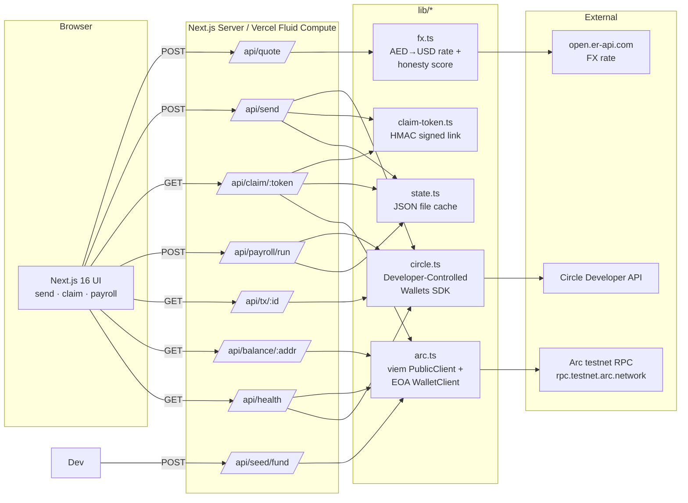

# RailAED - UAE → Anywhere remittances on Arc

> Pay in AED, settle in USDC on Arc, deliver to any corridor in seconds. With a live
> **honesty score** that compares every quote against Al Ansari, Wise, Western Union
> and Remitly so the sender always sees exactly what the recipient gets.

Built for the **[Stablecoin Commerce Stack Challenge](https://challenges.ignyte.ae/competition/4B436318-C737-F111-9A49-6045BD14D400)** by Ignyte, with Circle and Arc as technical sponsors.

- **Live demo:** [railaed-uae.vercel.app](https://railaed-uae.vercel.app)
- **Source:** [github.com/Vt01nft/railaed](https://github.com/Vt01nft/railaed)
- **Track:** Track 1 - Best Cross-Border Payments & Remittances Experience (UAE → Global)
- **Circle Developer Account:** `vt01nfts@gmail.com`
- **Circle products used:** USDC on Arc · Circle Developer-Controlled Wallets · Circle Gateway (treasury routing) · Nanopayments-style streaming payroll (real per-tick on-chain settlement on Arc today; Nanopayments batching is the production swap) · StableFX (`StableFXClient` seam built - mock by default, live rail drops in when gated access + AED pairs land) · CCTP V2 + Bridge Kit (planned for v2)
- **Chain:** Arc testnet (chain id `5042002`)
- **Status:** Testnet demo only · for educational purposes

---

## Why this exists

Dubai is the second-largest remittance-sending city in the world. UAE expats send
billions every year to India, the Philippines, Pakistan, Egypt, Bangladesh, Sri
Lanka and Nepal - and pay between **1.6% and 3.7%** in opaque, layered FX margins
to do it. The big stablecoin remittance products on the market today
(Sling Money, Bitnob, Felix Pago) target US, LATAM and Africa corridors.

**Nobody is building an end-to-end UAE-expat-outbound stablecoin product.** That's
the wedge RailAED takes on, on the rails Circle and Arc actually shipped.

---

## What's working today

A live demo on Arc testnet:

| Flow | Path | Verified on Arc |
|------|------|------------------|
| Quote | `POST /api/quote` | AED → USD → USDC + 5-competitor honesty score |
| Sign in | `POST /api/user/login` | Provisions a per-email Circle wallet on Arc + sets an HMAC session cookie |
| Self-fund | `POST /api/user/faucet` | Drips 5 USDC from the platform treasury to the signed-in user's wallet, returns the Arc tx hash |
| Send (from user) | `POST /api/send` (cookie) | Sends from the user's own wallet when signed in, otherwise from the treasury · `fundingSource` echoed in response |
| Send (no auth) | `POST /api/send` | Anonymous flow still works · provisions recipient wallet + transfers USDC + signs a claim token (~3 s) |
| Claim | `GET /api/claim/[token]` | HMAC-verified token, on-chain balance check, recipient view with corridor metadata |
| Payroll batch | `POST /api/payroll/run` | Parallel transfers from the platform wallet → N contractor wallets, all settled in seconds |
| Payroll stream | `POST /api/payroll/stream/start` + `…/settle` | Per-second salary accrual; each tick is a **real** USDC transfer on Arc, so one minute of streaming produces dozens of on-chain txs. Production swaps the per-tick transfer for Circle Nanopayments (gas-free, batched). |
| History | `GET /api/history` | Live feed sourced from Circle `listTransactions`; folds in the signed-in user's wallet so users see their own sends · `scope=me` for user-only |
| Health | `GET /api/health` | Arc RPC chain id + block, USDC decimals, owner & deployer balances, Circle wallet-set status |
| Seed funding | `POST /api/seed/fund` | Tops up the owner Circle wallet from the deployer EOA via viem (Circle's faucet returns 403 on this wallet - explained below) |

Sample on-chain proof (smoke test):

- Tx `0x72d155587065f44a8511d597e9b7c513d2196bd9bb2eb2ec624243ca0cf8df32`
  - 1.357386 USDC from owner Circle wallet → recipient wallet
  - **createDate → updateDate: 3 seconds**

---

## Architecture



**Money flow** for a send:

```
   AED in (UI)
        │
        ▼
[/api/send] ─── Circle SDK ─── createWallet(recipient)
        │                                │
        │            ┌───────────────────┘
        │            ▼
        │      new recipient address (Arc testnet)
        │            │
        └── Circle SDK ─── createTransaction(owner → recipient, USDC, Arc)
                                          │
                                          ▼
                              Arc testnet (≈3 s finality)
                                          │
                                          ▼
              Claim token (HMAC-SHA256, base64url) → share via WhatsApp link
                                          │
                                          ▼
                              Recipient opens /claim/<token>
                                          │
                                          ▼
                              viem reads recipient.balanceOf(USDC) - proof of receipt
```

---

## Getting started

### Prerequisites
- Node.js 22+ (tested on Node 26)
- A Circle Developer Platform account ([console.circle.com/signup](https://console.circle.com/signup)) and an API key with developer-controlled-wallets scope
- A wallet set + at least one wallet on `ARC-TESTNET`
- A funded EOA on Arc testnet (for bootstrap funding of the Circle wallet)

### Install & run

```bash
git clone <this-repo>
cd railaed
npm install
cp .env.example .env.local      # fill in your Circle + Arc keys
npm run dev                      # http://localhost:3000
```

### Environment variables (`.env.local`)

Server-only (do **not** prefix with `NEXT_PUBLIC_`):

| Var | What it is |
|-----|------------|
| `CIRCLE_API_KEY` | Testnet key (`TEST_API_KEY:...`) from Circle Console |
| `CIRCLE_ENTITY_SECRET` | 32-byte hex; generated once via `generateEntitySecret()` |
| `CIRCLE_ENTITY_SECRET_CIPHERTEXT` | Encrypted entity secret (registered with Circle) |
| `CIRCLE_WALLET_SET_ID` | UUID of your wallet set |
| `CIRCLE_OWNER_WALLET_ID` / `_ADDRESS` | The platform's treasury wallet (sender of all transfers, including streaming-payroll settlements) |
| `CIRCLE_AGENT_WALLET_ID` / `_ADDRESS` | Optional autonomous-operator wallet, reserved for future scheduled/agentic flows |
| `ARC_RPC_URL` | `https://rpc.testnet.arc.network` |
| `ARC_USDC_ADDRESS` | `0x3600000000000000000000000000000000000000` |
| `ARC_JOB_ESCROW_ADDRESS` | Reserved for a future milestone-escrow flow |
| `ARC_DEPLOYER_PRIVATE_KEY` / `ARC_DEPLOYER_ADDRESS` | EOA used by `/api/seed/fund` |
| `RAILAED_CLAIM_SECRET` | HMAC key for signing claim tokens |
| `STABLEFX_ENABLED` | `true` selects `LiveStableFXClient`; unset/false uses `MockStableFXClient` (default - gated access not yet granted) |

Public (browser-visible):

| Var | What it is |
|-----|------------|
| `NEXT_PUBLIC_ARC_CHAIN_ID` | `5042002` |
| `NEXT_PUBLIC_ARC_CHAIN_NAME` | `Arc Testnet` |
| `NEXT_PUBLIC_ARC_EXPLORER_URL` | `https://testnet.arcscan.app` |
| `NEXT_PUBLIC_ARC_USDC_ADDRESS` | Same as above |
| `NEXT_PUBLIC_ARC_JOB_ESCROW_ADDRESS` | Same as above |

### First-run bootstrap

```bash
# 1. Check connectivity + balances
curl http://localhost:3000/api/health

# 2. If the owner Circle wallet balance is 0, fund it from your deployer EOA
#    (Circle's testnet faucet returns 403 on already-provisioned wallets -
#     see "Circle Product Feedback" below)
curl -X POST http://localhost:3000/api/seed/fund \
  -H "content-type: application/json" \
  -d '{"amount":"5"}'

# 3. Send a real remittance on Arc
curl -X POST http://localhost:3000/api/send \
  -H "content-type: application/json" \
  -d '{"senderName":"Ahmed","senderAed":50,"recipientPhone":"+919999999999","corridor":"IN"}'
```

Open `http://localhost:3000/send` for the actual UI.

---

## Project layout

```
railaed/
├── app/
│   ├── page.tsx                       landing
│   ├── send/page.tsx                  sender flow
│   ├── claim/[token]/page.tsx         recipient claim flow
│   ├── payroll/page.tsx               employer dashboard
│   ├── layout.tsx                     header + footer
│   ├── globals.css                    Tailwind v4 + brand tokens
│   └── api/
│       ├── quote/route.ts             AED→USDC + honesty score
│       ├── send/route.ts              create recipient wallet + transfer + sign claim token (uses signed-in wallet if cookie present)
│       ├── claim/[token]/route.ts     verify token + on-chain balance
│       ├── tx/[id]/route.ts           Circle tx poll
│       ├── balance/[address]/route.ts USDC balanceOf via viem
│       ├── history/route.ts           live feed from Circle listTransactions, merges user+treasury when signed in
│       ├── payroll/contractors/route.ts  GET + PUT seed list
│       ├── payroll/run/route.ts       parallel transfers
│       ├── user/
│       │   ├── login/route.ts         provisions per-email Circle wallet + sets HMAC session cookie
│       │   ├── me/route.ts            returns current user + on-chain balance
│       │   ├── faucet/route.ts        drips 5 USDC from treasury to user wallet
│       │   └── logout/route.ts        clears session cookie
│       ├── faucet/route.ts            Circle testnet faucet (admin)
│       ├── seed/fund/route.ts         EOA→wallet bootstrap funding
│       └── health/route.ts            self-check
├── components/
│   ├── ui/                            button, card, input, badge
│   ├── sign-in-button.tsx             header chip + sign-in / wallet modal + faucet
│   ├── history-list.tsx               live activity feed with auto-refresh
│   ├── corridor-picker.tsx
│   ├── honesty-score.tsx
│   ├── address-pill.tsx
│   └── tx-state-badge.tsx
├── lib/
│   ├── env.ts                         typed env access (server-only, build-phase-safe)
│   ├── session.ts                     HMAC cookie session encode/decode/read/write/clear
│   ├── arc.ts                         viem PublicClient + WalletClient (deployer)
│   ├── circle.ts                      Circle SDK wrapper (createWallet, transferUsdc, listWalletTransactions)
│   ├── usdc.ts                        decimals (6), format helpers
│   ├── fx.ts                          live AED/USD + honesty score
│   ├── corridors.ts                   50 countries (8 featured) + dial codes + local-currency rates
│   ├── claim-token.ts                 HMAC-signed JWT-like claim links
│   ├── payroll-seed.ts                seed contractors used as fallback when state cache is empty
│   └── state.ts                       JSON-file cache (transfers, payroll, contractors, users)
└── docs/
    ├── RESEARCH.md                    1,100-line technical research
    └── STABLEFX_REQUEST.md            access-request email draft for gated rail
```

---

## Demo script (2 min)

1. **Land on `/`** - show the value prop. 2-sec settlement, 0.30 % fee, every Circle product we plan to use.
2. **`/send`** - enter `500 AED`, pick India. The quote settles instantly:
   - Recipient gets `135.74 USDC ≈ 11,293 INR`
   - Honesty-score table puts RailAED at the top vs Al Ansari / LuLu / Western Union / Remitly / Wise. Highlight the *AED 22 saved vs industry average* badge.
3. **Hit Send** - backend provisions a recipient wallet, transfers USDC, returns a claim link. Real Arc tx hash shown.
4. **Open the claim link** (WhatsApp share button, or in a new tab). Recipient sees the wallet, the on-chain USDC balance, the local-currency estimate, the explorer link. Tap "I've received it".
5. **`/payroll`** - table of contractors. Hit *Run payroll* - the page reports N parallel Circle txs, each fully traceable on ArcScan. Settled in seconds.
6. **End on `/api/health`** - show the live chain id, latest block, owner balance dropping, all green.

---

## "Wow" features that differentiate

1. **Live honesty score** - every quote shows what 5 traditional UAE rails would charge for the same AED, with `Δ USD` vs RailAED. Competitor fee data is illustrative; the FX leg runs through the `StableFXClient` seam (we requested live access - Circle confirmed it's gated and our submission didn't qualify yet, see `docs/STABLEFX_REQUEST.md`), so it ships labelled "simulated" until the real rail is granted.
2. **WhatsApp-native claim links** - recipients never install an app or see a hex address. They open a link, see USDC, tap claim. Cards are passkey-ready when we migrate to Modular Wallets.
3. **Per-recipient Circle wallets, not a shared escrow** - every send and every payroll line provisions a dedicated wallet for the recipient. ArcScan shows a real address you can audit, not an opaque pool.
4. **Per-user wallets with a one-tap self-fund** - sign in with an email, get a dev-controlled Circle wallet provisioned for you on Arc, drip yourself 5 USDC from the treasury, then send from your own balance. The history feed merges your wallet's txs with the treasury's so you can see your own activity. Migration path to Circle User-Controlled Wallets (PIN/passkey) is mapped in v2.
5. **Streaming payroll - built and live on Arc** - flip the `/payroll` toggle to *Live stream* and each contractor's salary accrues per second, settling on-chain on a short interval. Every tick is a **real** USDC transfer (verifiable on ArcScan), so a one-minute stream produces dozens of on-chain transactions - exactly the workload Circle **Nanopayments** is designed to batch gas-free in production. The per-tick transfer is the honest testnet stand-in for that batching; the swap is a single client.
6. **FX leg behind a Circle-native seam** - the AED→USDC rate flows through a `StableFXClient` interface (`lib/stablefx.ts`). Today it's `MockStableFXClient` (a live oracle, labelled "StableFX (simulated)" in the quote so it's never misrepresented); `LiveStableFXClient` drops in the moment gated access and AED pair coverage exist. The quote response carries the FX provider + settlement tenor so the UI tells the truth about which rail produced the number.

---

## Roadmap to v2 (post-hackathon)

| Item | Why it's next |
|------|---------------|
| Nanopayments-batched settlement | Streaming payroll already produces dozens of on-chain txs/min via per-tick transfers; swap the settle leg to Nanopayments for gas-free, sub-cent, batched settlement at scale |
| Modular Wallets w/ passkeys for recipients | Removes the last vestige of dev-custody from the recipient side |
| Real off-ramp partner integrations (PDAX, CoinDCX, local exchanges) | Closes the loop AED → USDC → local currency |
| StableFX live (`LiveStableFXClient` replaces the mock) | Seam already built - flip `STABLEFX_ENABLED` once access + AED↔INR/PHP/PKR pairs land |
| CCTP V2 + Bridge Kit | Lets the employer top-up USDC from Base/Eth before payroll runs |
| Production compliance (VARA license, CBUAE PTSR, FATF Travel Rule) | The non-trivial moat - pre-mapped in `docs/RESEARCH.md` |

---

## Circle Product Feedback

This is a required section of the hackathon submission. Honest notes from
building on the stack over a focused sprint:

### Why we chose these products

- **Circle Developer-Controlled Wallets** - for a UAE remittance app where recipients
  are not crypto-native, the sender shouldn't have to explain seed phrases. Dev-controlled
  wallets let us auto-provision per recipient and per contractor, with a passkey/email
  reveal path mapped out for v2.
- **USDC on Arc** - sub-second finality plus USDC-denominated gas means the sender's
  AED quote can be locked end-to-end. No "your tx is pending because gas spiked" UX
  failure mode.
- **Circle Gateway / Owner wallet pattern** - gives us a single treasury operator wallet
  to fan out from, which is exactly the operational shape a remittance back-office needs.
- **StableFX** *(requested - access gated)* - the only way to keep the FX leg on Circle's
  rails instead of scraping an external rate. We emailed Circle Customer Care during the
  sprint; they confirmed testnet allowlisting is limited to a select group of developers
  and our submission didn't qualify at this stage. So we ship the `StableFXClient` seam
  (mock by default, `LiveStableFXClient` behind `STABLEFX_ENABLED`) and label the rate
  "simulated" in the UI - the real rail is a one-flag swap if access lands.

### What worked well

- **`@circle-fin/developer-controlled-wallets` SDK** - typed end-to-end, `initiateDeveloperControlledWalletsClient`
  + `entitySecret` handles encryption transparently. The whole `createWallet → createTransaction → getTransaction`
  loop is exactly three calls.
- **Arc testnet RPC reliability** - sub-second confirmation in every smoke test. Going
  from `INITIATED` → `COMPLETE` in 3 s is a step change vs L2s I've used before.
- **USDC as gas** - removed an entire failure mode (no separate native-token funding step).
  Demo wallets don't need a faucet for ETH/MATIC/SOL on top of USDC.
- **Wallet set + per-wallet metadata** - `refId` made it easy to tie a Circle wallet
  back to our `railaed:transfer:<uuid>` namespace without adding a separate join table.

### What could be improved

1. **Surface real validation errors.** `createWallets` / `createTransaction` failures
   come back as `Error: API parameter invalid` with `code: 2, status: 400` and *no
   message field*. We had to bisect (`accountType: 'SCA'` is rejected on Arc; missing
   `blockchain` on a `tokenAddress` transfer is rejected; long `name` in `metadata`
   is rejected). A `details` array or `message` field would have saved an hour.
2. **Document Arc's wallet account-type compatibility.** SCA is in the SDK union type
   but rejected at runtime on Arc - there's no signal in the docs that EOA is the
   only valid choice today.
3. **Faucet permissions.** `client.requestTestnetTokens({ blockchain: 'ARC-TESTNET',
   usdc: true })` returns 403 against our owner wallet even though the same wallet
   was provisioned via the same API key. We had to bootstrap by transferring USDC
   from a separately-funded EOA. Either grant faucet access by default on
   wallet-set-created wallets, or document which wallet types are faucet-eligible.
4. **USDC decimals on Arc.** Multiple Circle/Arc docs and educational posts say "USDC
   on Arc uses 18 decimals." On-chain `decimals()` returned **6** - same as USDC
   everywhere else. We had to discover this empirically. Worth a callout in the Arc
   USDC doc page (or fix the docs).
5. **`TestnetBlockchain` and `Blockchain` overlap.** The SDK has two enums that both
   include `ARC-TESTNET`; transfer endpoints use `TokenBlockchain`, wallet creation
   uses `Blockchain`. Light unification would remove a class of foot-guns.
6. **StableFX vs USYC access channel.** The hackathon-prescribed support subject line
   ("USYC or StableFX testnet request") meant our StableFX ask was handled as a USYC
   allowlisting request and declined with a USYC-specific template - the StableFX part
   was never addressed separately. A dedicated StableFX access path (or a clear "StableFX
   is granted/declined separately" note) would remove the ambiguity for hackathon teams.

### Recommendations to make the developer experience more seamless

- **Ship a Next.js starter that uses Developer-Controlled Wallets on Arc** - the
  existing `circlefin/arc-p2p-payments` starter uses Modular Wallets + Supabase + Docker,
  which is a heavy entry point for "I want to wire an Arc transfer in 30 minutes."
- **Add a `client.healthCheck()` to the SDK** that returns whether the key, entity
  secret ciphertext, and wallet set are all coherent. Shaves the first-hour onboarding
  experience by a lot.
- **A tiny `viem` plugin** (`viem/chains/arc-testnet`) - every team building on Arc is
  copy-pasting `defineChain` blocks. Owning the canonical export upstream would prevent
  drift (RPC URLs, USDC address) across community projects.

---

## License

For the Stablecoin Commerce Stack Challenge. Demo / educational use only.
